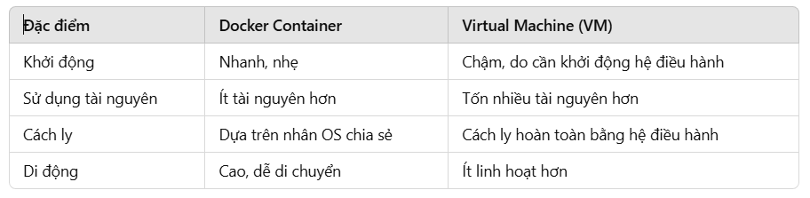

# Docker

DockerImage = <Repository>:<tag>

**1, Những lí do triển khai giữa các máy khác nhau không chạy được**

- Thiếu một số file hoặc thư mục .
- Khác nhau về phiên bản .
- Khác nhau về cấu hình .

—> Docker ra đời để giải quyết vấn đề này. Docker sẽ đóng gói ứng dụng trong container và triển khai để tất cả các máy có thể sử dụng dễ dàng .

**2, Container vs Virtual Machine**

**3, Kiến trúc của docker**

- Docker hoạt động theo mô hình client-server. Client sẽ giao tiếp với server thông qua Rest API.
- Docker Client - Docker Daemon (chịu trách nhiệm quản lý Docker Container và xử lí các yêu cầu của Docker Client) .

**4, Docker Image và Docker Container**

- Docker Image chứa mọi thứ cần thiết để chạy ứng dụng: mã nguồn, thư viện và thiết lập cấu hình .
- Docker Container: Là một phiên bản đang chạy của Docker Image .

**5, Work Flow**

- Từ DockerFile, Docker sẽ đóng gói ứng dụng thành DockerImage. Sau đó từ DockerImage này có thể khởi chạy các container để chạy ứng dụng. Các container được lưu trữ trong kho container .

**6, Docker Command**

- `docker ps` : các containers đang chạy
- `docker images` : các images có trên máy
- `docker load -i file` : load image file trên máy không cần internet (i : input)
- `docker container exec` hoặc `docker exec` : truy cập vào container để chạy bằng bash
- `docker build -t ten_image .` : build image, `.` tức là docker file ở thư mục hiện hành , có thể thay bằng đường dẫn chứa docker file (thay bằng đường dẫn tới thư mục chứa dockerfile-  có dấu nháy , ví dụ : ‘D:/HocTap’ )
- `docker system prune` : giải phóng bộ nhớ của docker

**6.1, Docker image Command**

- docker version : Hiển thị thông tin phiên bản hiện tại của docker .
- docker images : Hiển thị tất cả image hiện có .
- docker pull <ImageName> : Tải Docker Image từ Docker Hub .
- docker rmi <ImageId> : Xóa Image .

**6.2, Docker Container Command**

- docker run <ImageName> : chạy Image có tên ImageName (kết hợp giữa lệnh docker pull và docker start) .
- docker run -p<HostPost>:<ContainerPost> <ImageName> : chạy Image với các cổng HostPost và Container Port được định nghĩa sẵn .
- docker ps  : Hiển thị các container đang chạy .
- docker ps -a : Hiển thị cả container đã dừng.
- docker stop <container_id> : Dừng một container .
- docker start <container_id> : Khởi động lại 1 container đã dừng .
- docker rm <container_id>: Xóa một container .

 **6.3, Docker Command #**

- docker logs <container_id> : Xem log của container .
- docker logs —tail <N> <containerId> : N: số dòng log cuối
- docker exec -it <container_id> bash : Mở một shell mới tương tác trực tiếp với container để thoát ra sử dụng lệnh exit .

**7, Docker Network**

- docker network ls : Hiển thị các network hiện có
- docker network create <NetworkName> : Tạo network mới
- docker rmv <NetworkName> : Xóa một network

**8, Docker Compose**

- Docker Compose cho phép định nghĩa và quản lý nhiều container dễ dàng. Thay vì phải chạy thủ công bằng lệnh docker run, Docker compose cho phép định nghĩa tất cả container, network, volumes trong một file cấu hình yaml.

Cấu trúc file YAML:

**8.1, Docker Compose Command**

- docker-compose -f <file Yaml> up -d : khởi động dịch vụ được định nghĩa trong file yaml
- docker-compose -f <file Yaml> down : Dừng và xóa các container, network, volumes được tạo ra bởi docker compose dựa trên tệp yaml .

**9, Dockerfile**

Jenkins thực hiện build image dựa trên Dockerfile

- docker build -t <ImageName> .  : tìm file docker trong thư mục hiện tại và build image với tên là ImageName .

**10, Push Docker Image**

Các bước thực hiện push Docker Image lên Docker Hub

- 1, docker login
- 2, docker tag <local-image-name:tag> <username>/<repository-name>:<tag>
- 3, docker push <username>/<repository-name>:<tag>

**11, Thông tin liên quan đến dự án test**

- Url : [Docker Tutorial for Beginners [FULL COURSE in 3 Hours] - YouTube](https://www.youtube.com/watch?v=3c-iBn73dDE&list=LL&index=1&t=4s)
- Link git: [Nana Janashia / techworld-js-docker-demo-app · GitLab](https://gitlab.com/nanuchi/techworld-js-docker-demo-app)
- pull mongodb and mongo express:
    - commands:
    docker pull mongo-express:0.49
    docker pull mongo:4.2.1
- docker run -p 27017:27017 -d -e MONGO_INITDB_ROOT_USERNAME=admin -e MONGO_INITDB_ROOT_PASSWORD=password --name mongodb --net mongo-network <ContainerID>  :
- docker run -d -p 8081:8081 -e ME_CONFIG_MONGODB_ADMINUSERNAME=admin -e ME_CONFIG_MONGODB_ADMINPASSWORD=password --net mongo-network --name mongo-express -e ME_CONFIG_MONGODB_SERVER=mongodb <ContainerId>